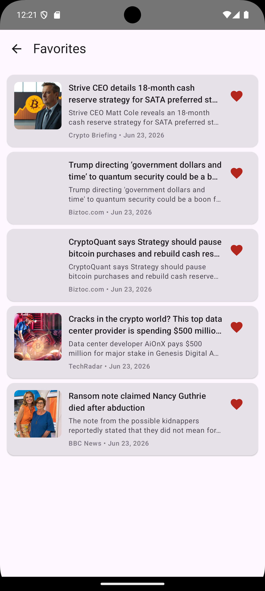
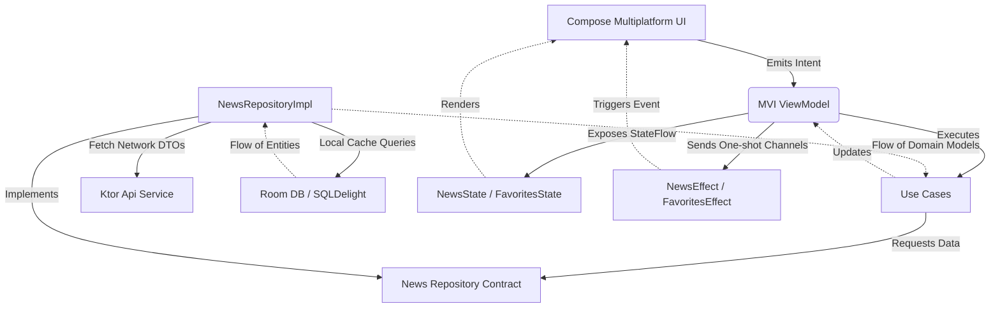

# 📰 Briefly — Kotlin Multiplatform News Application

[](https://kotlinlang.org/)
[](https://www.jetbrains.com/lp/compose-multiplatform/)
[](https://ktor.io/)
[](https://developer.android.com/kotlin/multiplatform/room)
[](https://insert-koin.io/)

**Briefly** is a professional, production-ready Kotlin Multiplatform (KMP) news application targeting **Android** and **iOS** platforms. It implements **Clean Architecture** combined with the **Model-View-Intent (MVI)** design pattern to achieve a highly testable, reactively driven, and decoupled codebase. The UI is built entirely using **Compose Multiplatform**, sharing 100% of the UI layout code across both platforms.

---

## 📸 Screenshots

| Android (News Feed) | iOS (News Feed) | Android (Favorites) | iOS (Favorites) |
|:---:|:---:|:---:|:---:|
|  |  |  |  |

> [!NOTE]
> *The screenshot links above are placeholders. Make sure to replace these links with your actual project screenshots once the application is uploaded to your git repository.*

---

## ✨ Features

- 🌐 **Browse Latest News**: Fetch real-time articles from the NewsAPI standard endpoint.
- 🔍 **Search Articles**: Find news articles by search terms dynamically.
- 💖 **Favorites System**: Save interesting articles locally for quick access.
- 📴 **Offline Access**: Fully offline-capable database storage for favorite articles.
- ⚡ **Reactive MVI Architecture**: Predictable, unidirectional state management leveraging Kotlin Coroutines and Flow.
- 🎨 **Compose Multiplatform UI**: Completely shared layout styling, colors, and UI widgets between Android and iOS.
- 🛠️ **Dependency Injection**: Seamless dependency provisioning and platform bindings configured with Koin.
- 🛡️ **Error & Loading Handling**: Seamless transitions between loading states, empty lists, success results, and standard API errors.

---

## 🏛️ Architecture & Design Pattern

The project is structured under **Clean Architecture** principles and implements the **MVI (Model-View-Intent)** design pattern in the presentation layer.



### 📂 The Core Layers

#### 1. Domain Layer (Pure Kotlin)
* **Entities**: Core business models (like [NewsArticle](file:///d:/MOON_data/MONA_Career/iti9/KMP/FirstProject/shared/src/commonMain/kotlin/com/example/firstproject/domain/NewsArticle.kt)) defining our application rules.
* **Use Cases**: Encapsulate single, testable business interactions (like [GetNewsUseCase](file:///d:/MOON_data/MONA_Career/iti9/KMP/FirstProject/shared/src/commonMain/kotlin/com/example/firstproject/domain/UseCase.kt#L11-L18) or [AddFavoriteUseCase](file:///d:/MOON_data/MONA_Career/iti9/KMP/FirstProject/shared/src/commonMain/kotlin/com/example/firstproject/domain/UseCase.kt#L26-L42)).
* **Repository Contracts**: Interfaces defining rules for querying and updating data, decoupling business logic from any third-party framework dependencies.

#### 2. Data Layer
* **Data Sources**: Handles remote networking via **Ktor Client** ([NewsApiService](file:///d:/MOON_data/MONA_Career/iti9/KMP/FirstProject/shared/src/commonMain/kotlin/com/example/firstproject/data/NewsApiService.kt)) and local data caching using SQLite with **Room KMP** ([NewsDatabase](file:///d:/MOON_data/MONA_Career/iti9/KMP/FirstProject/shared/src/commonMain/kotlin/com/example/firstproject/data/Newsdatabase.kt)).
* **Mappers**: Pure mapper utilities mapping DTO representations and DB entities to Domain-specific models ([NewsMapper](file:///d:/MOON_data/MONA_Career/iti9/KMP/FirstProject/shared/src/commonMain/kotlin/com/example/firstproject/data/Newsmapper.kt)).
* **Repositories**: Concrete implementations (like [NewsRepositoryImpl](file:///d:/MOON_data/MONA_Career/iti9/KMP/FirstProject/shared/src/commonMain/kotlin/com/example/firstproject/data/Newsrepositoryimpl.kt)) orchestrating data flows from remote services and the local database.

#### 3. Presentation Layer
* **MVI Structure**: Driven by `Intent`, `State`, and `Effect` contracts.
* **ViewModels**: Shared components extending `androidx.lifecycle.ViewModel` that consume intents, fetch data, and modify the UI state flow accordingly.
* **UI**: Shared screens and components built with **Compose Multiplatform**.

---

## ⚡ State Management with MVI

MVI (Model-View-Intent) represents a unidirectional flow where state is immutable and events move in a single loop:
* **Intent**: Represents user or system actions (e.g., `LoadNews`, `ToggleFavorite`).
* **State**: An immutable container representing the current visible screen content (e.g., `Loading`, `Success`, `Error`, `Empty`).
* **Effect**: Side-effects representing single-time operations that should not persist over configuration changes (e.g., showing a SnackBar).

### MVI Implementation Example

1. **Contracts (`NewsState`, `NewsIntent`, `NewsEffect`)**
```kotlin
sealed interface NewsState {
    data object Loading : NewsState
    data class Success(val articles: List<NewsArticle>) : NewsState
    data class Error(val message: String) : NewsState
    data object Empty : NewsState
}

sealed interface NewsIntent {
    data object LoadNews : NewsIntent
    data class ToggleFavorite(val article: NewsArticle) : NewsIntent
}

sealed interface NewsEffect {
    data class ShowSnackbar(val message: String) : NewsEffect
}
```

2. **ViewModel Flow Processing (`NewsViewModel`)**
```kotlin
class NewsViewModel(
    private val getNewsUseCase: GetNewsUseCase,
    private val addFavoriteUseCase: AddFavoriteUseCase,
    private val removeFavoriteUseCase: RemoveFavoriteUseCase
) : ViewModel() {

    private val _state = MutableStateFlow<NewsState>(NewsState.Loading)
    val state: StateFlow<NewsState> = _state.asStateFlow()

    private val _effect = Channel<NewsEffect>(Channel.BUFFERED)
    val effect: Flow<NewsEffect> = _effect.receiveAsFlow()

    fun onIntent(intent: NewsIntent) {
        when (intent) {
            is NewsIntent.LoadNews -> loadNews()
            is NewsIntent.ToggleFavorite -> toggleFavorite(intent.article)
        }
    }
    
    // Core business operations run asynchronously in viewModelScope...
}
```

---

## 💾 Favorites Implementation Details

The favorite system provides real-time reactive updates from local database storage:

1. **Room Database**: The `NewsDatabase` holds a `favorite_articles` table. Because it uses Room KMP, actual DB builders are delegated using `@ConstructedBy(NewsDatabaseConstructor::class)` to initialize the database schema on Android and iOS dynamically.
2. **Dao Observation**: The `FavoriteDao` exposes a query yielding a reactive flow (`Flow<List<FavoriteArticleEntity>>`):
   ```kotlin
   @Query("SELECT * FROM favorite_articles")
   fun observeFavorites(): Flow<List<FavoriteArticleEntity>>
   ```
3. **Repository Sync**: `NewsRepositoryImpl` maps these entities to domain models (`NewsArticle`) and exposes the flow. When saving or removing, it coordinates with the DAO:
   ```kotlin
   override fun observeFavorites(): Flow<List<NewsArticle>> =
       favoriteDao.observeFavorites().map { entities ->
           entities.map { it.toDomainModel() }
       }
   ```
4. **Optimistic Updates**: To ensure high performance, when a user clicks the favorite heart icon, the `NewsViewModel` immediately performs an **optimistic update** on the cached state list so the UI updates without lag, while dispatching the background database transaction asynchronously.

---

## 🛠️ Technology Stack & Library Selection

| Library | Version | Purpose & Selection Justification |
| :--- | :--- | :--- |
| **Compose Multiplatform** | `1.11.1` | Jetpack Compose for shared layouts. Offers a single declarative UI codebase with native drawing speeds on Android and iOS. |
| **Ktor Client** | `3.5.0` | Asynchronous, platform-independent networking client. Chosen over Retrofit for seamless multiplatform networking. |
| **AndroidX Room (KMP)** | `2.8.4` | SQLite wrapper supporting native KMP compilation. Replaces SQLDelight by providing SQL verification, standard annotation mappings, and DAO flows out of the box. *(Note: Badge matches original project specification, but SQLite/Room implementation is utilized)*. |
| **Koin** | `4.2.2` | Pragmatic dependency injection framework built specifically for Kotlin. Handles lifecycle binds and platform-specific platform declarations seamlessly. |
| **Kotlin Coroutines / Flow** | `1.11.0` | Provides structural concurrency and reactive data streams, essential for driving MVI architectures. |
| **Coil 3** | `3.0.4` | Shared image loader leveraging Ktor engine for downloading and caching remote thumbnails efficiently. |

---

## 📁 Project Folder Structure

```
FirstProject/
├── androidApp/                     # Android specific application target
│   └── src/main/kotlin/            # Entry point (NewsApplication.kt & MainActivity.kt)
├── iosApp/                         # iOS specific Xcode project container wrapper
├── shared/                         # Core module containing KMP logic and Compose UI
│   ├── src/
│   │   ├── commonMain/kotlin/      # Platform-agnostic source code
│   │   │   └── com/example/firstproject/
│   │   │       ├── App.kt          # Shared Root UI Entry Point
│   │   │       ├── data/           # Ktor Api Service, Room Database, DAOs, and Entities
│   │   │       ├── di/             # Koin Modules (Network, Database, Repo, VM, and UseCase)
│   │   │       ├── domain/         # Core Use Cases, Domain models, and Repository contracts
│   │   │       └── presentation/   # Presentation Layer (divided by screens: news, favorites)
│   │   ├── androidMain/            # Platform implementations for Android (Database configs)
│   │   └── iosMain/                # Platform implementations for iOS (MainViewController, iOS DB configs)
│   └── build.gradle.kts            # Shared module configuration (targets, dependencies)
└── gradle/                         # Gradle settings and Versions configuration file (libs.versions.toml)
```

---

## 🚀 Setup & Installation

### Prerequisites
- **macOS** (necessary if building/running the iOS version).
- **Android Studio** Ladybug or newer.
- **Xcode** 15+ (for iOS build/simulator).
- **JDK 17** or higher.

### API Key Setup
The project uses [NewsAPI](https://newsapi.org/) to fetch articles.
1. Sign up on [NewsAPI](https://newsapi.org/) and copy your API key.
2. Under the root project directory, locate or create a `local.properties` file:
   ```properties
   # local.properties
   NEWS_API_KEY="YOUR_API_KEY_HERE"
   ```

---

## 🏗️ Build & Run

### Android
To compile and install the Android application on a physical device or emulator, execute:
```bash
./gradlew :androidApp:installDebug
```
Alternatively, open the project in **Android Studio**, select the `androidApp` run configuration from the toolbar dropdown, and click **Run** (▶).

### iOS
To launch the iOS simulator:
1. Open the project configuration in Xcode:
   ```bash
   open iosApp/iosApp.xcodeproj
   ```
2. Choose your target simulator device.
3. Click the **Run** button inside Xcode, or use command-line interface execution via Gradle:
   ```bash
   ./gradlew :shared:linkDebugFrameworkIosSimulatorArm64
   ```

---

## 🔮 Future Enhancements

- [ ] **Dynamic Search Caching**: Store queries and recent search outputs directly inside Room database.
- [ ] **Full Pagination**: Implement paging logic using Jetpack Paging Multiplatform library for infinite scrolling.
- [ ] **Advanced Error Recovery**: Add offline-first capabilities where network news is cached automatically.
- [ ] **System Dark Mode**: Implement fully automated dark and light material themes responsive to device settings.
- [ ] **Desktop Client Support**: Extend Compose target definitions to build the project as a desktop executable.

---

## 🤝 Contributing

Contributions are welcome! Please follow these guidelines:
1. **Fork** the repository.
2. Create a feature branch: `git checkout -b feature/NewFeature`
3. Commit your changes: `git commit -m 'Add some feature'`
4. Push to the branch: `git push origin feature/NewFeature`
5. Open a **Pull Request**.

---

## 📄 License

```
MIT License

Copyright (c) 2026 Briefly Contributors

Permission is hereby granted, free of charge, to any person obtaining a copy
of this software and associated documentation files (the "Software"), to deal
in the Software without restriction, including without limitation the rights
to use, copy, modify, merge, publish, distribute, sublicense, and/or sell
copies of the Software, and to permit persons to whom the Software is
furnished to do so, subject to the following conditions:

The above copyright notice and this permission notice shall be included in all
copies or substantial portions of the Software.

THE SOFTWARE IS PROVIDED "AS IS", WITHOUT WARRANTY OF ANY KIND, EXPRESS OR
IMPLIED, INCLUDING BUT NOT LIMITED TO THE WARRANTIES OF MERCHANTABILITY,
FITNESS FOR A PARTICULAR PURPOSE AND NONINFRINGEMENT. IN NO EVENT SHALL THE
AUTHORS OR COPYRIGHT HOLDERS BE LIABLE FOR ANY CLAIM, DAMAGES OR OTHER
LIABILITY, WHETHER IN AN ACTION OF CONTRACT, TORT OR OTHERWISE, ARISING FROM,
OUT OF OR IN CONNECTION WITH THE SOFTWARE OR THE USE OR OTHER DEALINGS IN THE
SOFTWARE.
```
